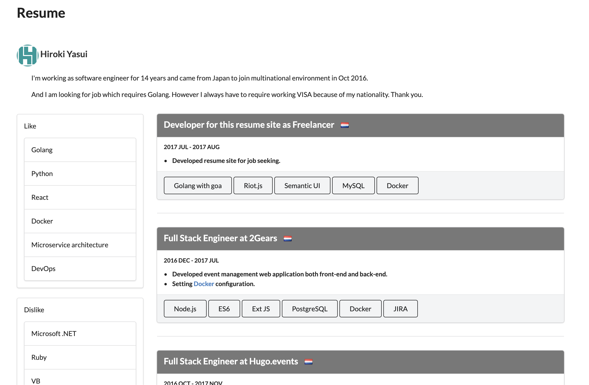

# go-goa

[](https://goreportcard.com/report/github.com/hiromaily/go-goa)
[](https://codebeat.co/projects/github-com-hiromaily-go-goa-master)
[](https://www.codacy.com/app/hiromaily2/go-goa?utm_source=github.com&amp;utm_medium=referral&amp;utm_content=hiromaily/go-goa&amp;utm_campaign=Badge_Grade)
[](https://raw.githubusercontent.com/hiromaily/go-goa/master/LICENSE)

`go-goa` is example of [goa](https://github.com/goadesign/goa) framework for v3 with JWT implementation.  
The example site consists of file server and API server.




## Refactoring
- [ ] Clean up everything
- [ ] Integrate to Firebase using NextJS SSG
- [ ] Switch CI from TravisCI to Github Action
- [ ] Rebuild front-end by latest Next.js(React) or Svelte
- [ ] Replace E2E test by [Hurl](https://hurl.dev/)

## Directory Structure
| Directory Name | Description                                           |
|:---------------|:------------------------------------------------------|
| docs(assets)   | assets for front-end                                  |
| build          | docker/gcp configuration files                        |
| cmd            | main.go for cli/server                                |
| config         | toml configuration files                              |
| internal       | goa design files, generated files as separated module |
| pkg            | go files                                              |
| scripts        | shell script                                          |
| web            | developmental environment for front-end               |

### pkg directory
| Directory Name | Description                                    |
|:---------------|:-----------------------------------------------|
| config         | config pkg to read toml file                   |
| encryption     | encryption for hash                            |
| goa            | goa logic based on generated file by `goa gen` |
| jwts           | jwt                                            |
| logger         | logger using `rs/zerolog`                      |
| model          | auto generated by `sqlboiler`                  |
| mysql          | mysql                                          |
| repository     | database operation                             |


## Install goa
```
go install goa.design/goa/v3/cmd/goa@v3
go install google.golang.org/protobuf/cmd/protoc-gen-go@latest
go install google.golang.org/grpc/cmd/protoc-gen-go-grpc@latest
```


## Development process
- `cd internal/goa/service/resume`
- modify `design` files
- generate files by `goa gen`


## Server
### Database
- run MySQL first
```
docker compose mysql -d
```

### File Server
```
go build -v -o ${GOPATH}/bin/goa-file-server ./cmd/fileserver/server/...
goa-file-server
```
- access
  - `http://localhost:8080/`
  - `http://localhost:8080/login.html` (hiroki@goa.com / password)

### Resume API Server
```
go build -v -o ${GOPATH}/bin/goa-server ./cmd/resume/server/...
goa-server -conf ./configs/settings.toml
```

### Resume API List
- health
  - `http://localhost:8090/api/health`
- auth
  - `http://localhost:8090/api/auth/login`
- tech
  - `http://localhost:8090/api/tech`
  - `http://localhost:8090/api/tech/1`
- company
  - `http://localhost:8090/api/company`
  - `http://localhost:8090/api/company/1`
- user
  - `http://localhost:8090/api/user`
  - `http://localhost:8090/api/user/1`
- user tech
  - `http://localhost:8090/api/user/1/liketech`
  - `http://localhost:8090/api/user/1/disliketech`
- user work history
  - `http://localhost:8090/api/user/1/workhistory`


## Performance
To eveluate performance, [hey](https://github.com/rakyll/hey) has been used.
Execute `Make bench`

```
# March 12 2017
hey -n 20000 -c 50 -m GET http://localhost:8080/api/user

Summary:
  Total:	4.1092 secs
  Slowest:	0.0939 secs
  Fastest:	0.0002 secs
  Average:	0.0101 secs
  Requests/sec:	4867.1221
  Total data:	60000 bytes
  Size/request:	3 bytes

Status code distribution:
  [200]	20000 responses
```

## Licence
[MIT](https://github.com/hiromaily/go-goa/blob/master/LICENSE)

## Author
[hiromaily](https://github.com/hiromaily)
